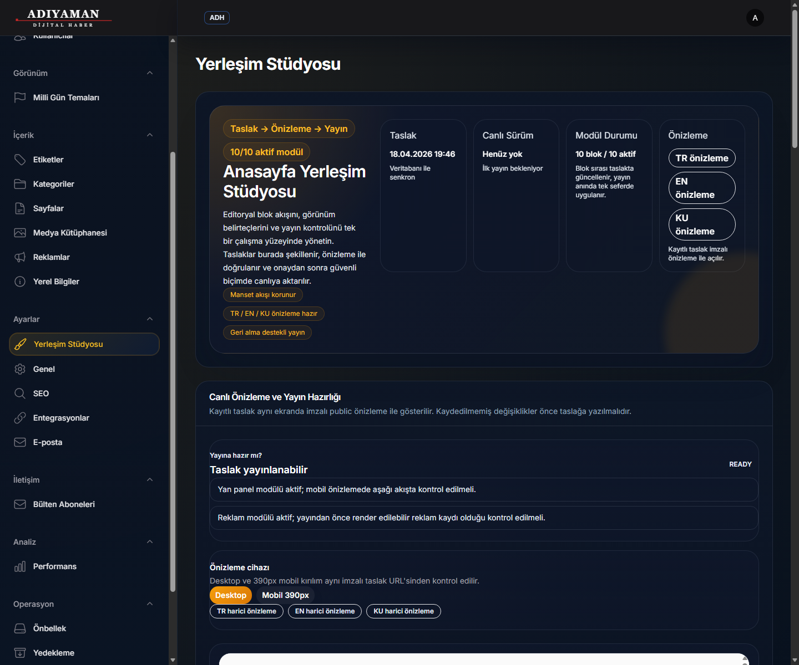
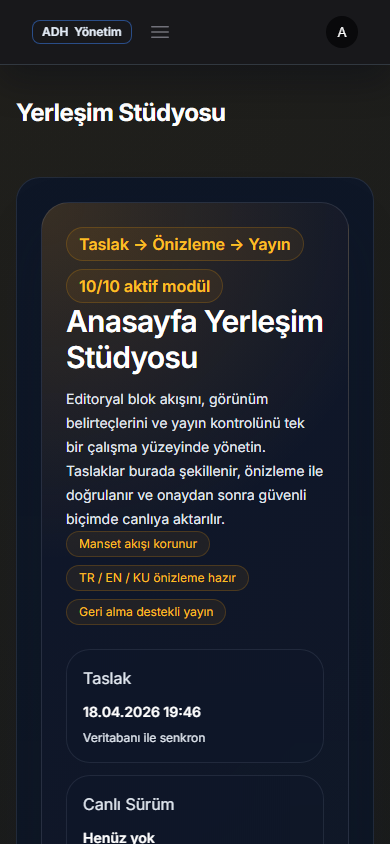
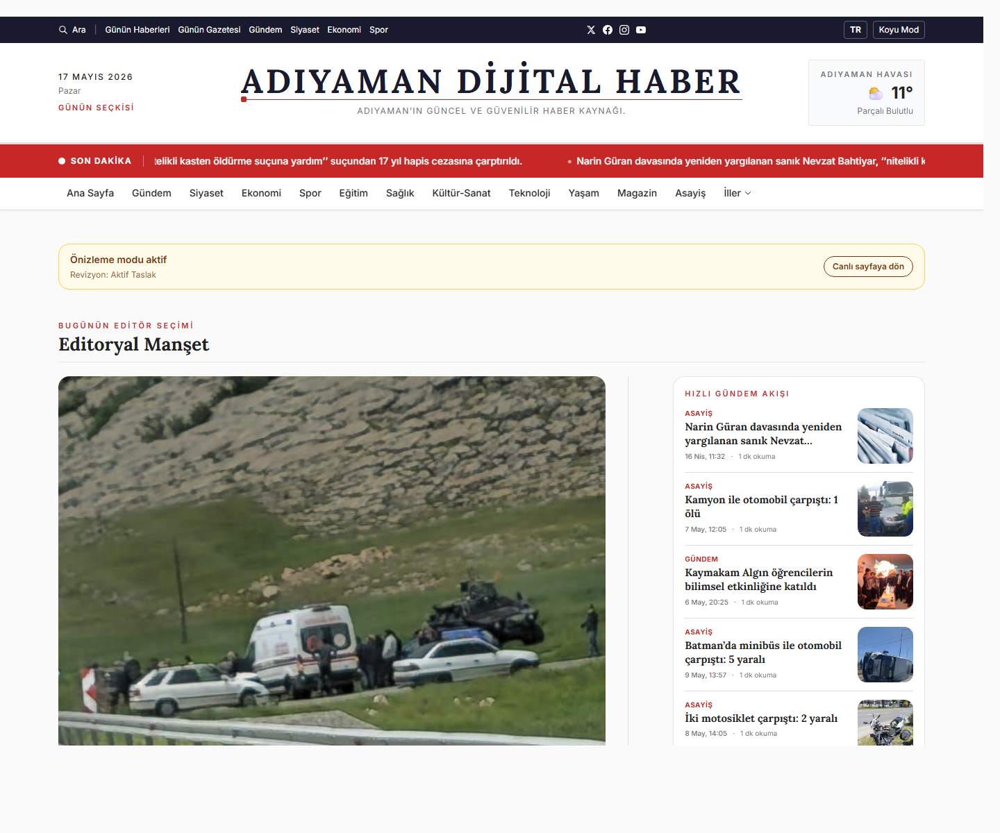
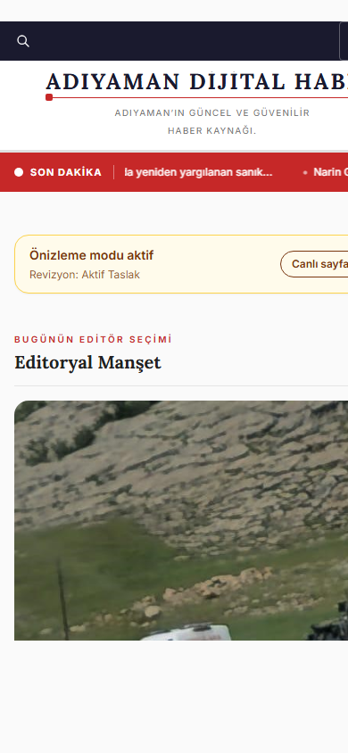

# ADH Layout Studio Final Effectiveness - 2026-05-14

## Verdict

Status: `PASS_LOCAL`

Layout Studio is now stronger than the prior technical smoke state. The core product model remains unchanged: curated homepage management, draft-first editing, super-admin-only publish, signed external preview, and disabled legacy LayoutManager.

The new work adds:

- Panel-level readiness state: draft/live/preview/publish safety is visible in the studio surface.
- Embedded signed preview iframe with desktop and 390px mobile toggle.
- Server-side publish quality gate, not only disabled UI buttons.
- Preview-mode cookie banner suppression so admin preview screenshots are not polluted by consent UI.
- Regression tests for invalid draft states, CTA failures, preview rendering, and device toggle behavior.

Authenticated admin-panel browser screenshots and public signed preview screenshots were captured through local Edge/CDP evidence and are attached below.

## Scope Boundary

Included:

- Homepage Layout Studio only.
- Draft/publish/restore safety.
- Panel embedded preview.
- Publish quality gate.
- Desktop/mobile public signed preview evidence.

Excluded:

- Category/news detail layout management.
- Advertisement business rules beyond warning surface.
- General public mobile header redesign.
- Full admin mobile UX QA.

## Implementation Summary

### LayoutStudio Page

File: `app/Filament/Pages/LayoutStudio.php`

- Added `previewDevice` state and `setPreviewDevice()` for desktop/mobile preview switching.
- Added `getLayoutReadiness()` as the central readiness contract.
- Added blocking publish rules:
  - No active editorial homepage module.
  - Hero missing, inactive, or invisible on every device.
  - Active module invisible on every device.
  - Content limit below 1.
  - CTA enabled without TR label.
  - CTA enabled without an allowed URL.
- Added non-blocking warnings:
  - Very high content limit can create mobile density risk.
  - Ads module requires renderable ad inventory check.
  - Sidebar widgets should be verified in mobile flow.
- `publishDraft()` now enforces readiness before mutating live state.

### Layout Studio UI

File: `resources/views/filament/pages/layout-studio.blade.php`

- Added "Canli Onizleme ve Yayin Hazirligi" section.
- Added readiness status chip and error/warning list.
- Added clear unsaved-change warning: preview shows the last saved draft.
- Added embedded iframe using the signed draft preview URL.
- Added desktop/mobile preview toggle.
- Publish buttons are disabled when the readiness gate is blocked.

### Preview Cookie Behavior

File: `resources/views/cookie-consent.blade.php`

- Cookie consent banner is suppressed for Layout Studio preview mode.
- Normal public pages still render cookie consent behavior.

### Test Coverage

File: `tests/Feature/Filament/ContentOperationsAndLayoutTest.php`

Added coverage:

- Invalid draft with all editorial modules disabled cannot publish.
- CTA-enabled module without required label/URL cannot publish.
- Live state remains unchanged after blocked publish.
- Layout Studio page renders embedded preview controls.
- Preview device toggle switches desktop/mobile state.
- Signed preview does not render the cookie consent component.

## Test Evidence

Command:

```powershell
php artisan test tests\Feature\Filament\ContentOperationsAndLayoutTest.php tests\Unit\Services\LayoutConfigServiceTest.php
```

Result:

```text
PASS
Tests: 13 passed (70 assertions)
```

Command:

```powershell
php artisan test tests\Feature\Filament\AdminGuideModeTest.php tests\Unit\Support\AdminPrivilegesTest.php
```

Result:

```text
PASS
Tests: 7 passed (24 assertions)
```

Command:

```powershell
php artisan test tests\Feature\Public\PublicPagesTest.php
```

Result:

```text
PASS
Tests: 19 passed (113 assertions)
```

Command:

```powershell
php artisan test tests\Feature\Filament\AdminLanguageQualityTest.php
```

Result:

```text
PASS
Tests: 2 passed (122 assertions)
```

Syntax:

```powershell
php -l app\Filament\Pages\LayoutStudio.php
```

Result:

```text
No syntax errors detected
```

## Screenshot Evidence

Screenshot directory:

`docs/reports/assets/layout-studio-final-2026-05-14/`

Generated files:

- `admin-layout-studio-desktop.png`
- `admin-layout-studio-mobile-390.png`
- `admin-layout-studio-cdp-state.txt`
- `layout-preview-desktop.png`
- `layout-preview-mobile-390.png`
- `preview-url.txt`

Authenticated admin desktop:



Authenticated admin mobile:



Desktop signed preview:



Mobile signed preview:



## Findings

### Finding 1 - Public mobile header still has unrelated clipping risk

Severity: `P3`

Risk: The 390px signed preview shows the public header/logo area can clip horizontally. This is not a Layout Studio regression, but it affects mobile preview quality.

Recommended next action: Keep this under the existing public mobile header/navigation scope, not under Layout Studio.

### Finding 2 - Admin mobile view is usable but not a dedicated mobile authoring experience

Severity: `P3`

Risk: The authenticated mobile screenshot proves the Studio opens and stacks correctly, but the large studio hero and long cards mean serious editing is still better on desktop/tablet.

Recommended next action: Treat full admin mobile authoring optimization as a separate admin UX scope. This Layout Studio scope only required that the panel not break on mobile.

## Go / No-Go

Local functional decision: `GO`

Reasons:

- Draft save does not mutate live homepage.
- Publish mutates live homepage only through the established publish path.
- Editor can save draft but cannot publish.
- Super admin publish is still allowed.
- Unsafe layouts are blocked before live mutation.
- Signed preview continues to work.
- Legacy LayoutManager remains disabled.

Visual decision: `GO`

Reasons:

- Public signed preview desktop/mobile evidence exists.
- Authenticated admin desktop/mobile screenshot evidence exists.

## Next Step

Recommended next step: close the Layout Studio final effectiveness scope, then move back to the broader public mobile/header and admin readiness queue.
